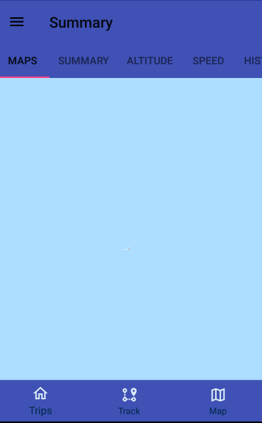
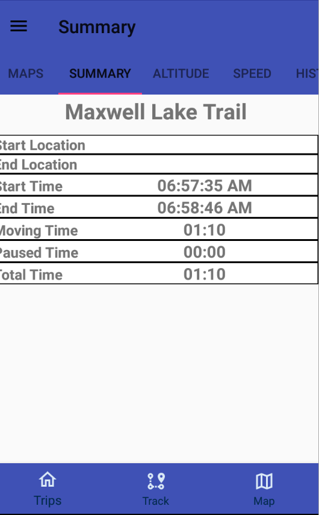

# Android GEOTracker App

## GEOTracker

### Develop Android application to track GPS data for hikes, bikes, car trips, etc.

	- Simple Android app that tracks GPS location.
	- Use for bike/hike/car/etc.
	- Write to SQLite database.
		- Sync with external database.
    - Able to add routes.

### Features
    - Track GPS data for different activities.  
    - Users will have the ability to create different activities.  App will have default activities of bike, run, hike, walk.
    - Data saved to sqllite database.
    - User will have the ability to filter view by activity and routes.
    - Display GPS data on map.
### Planned Features    
    - Add photos.   
    - Analytics. 
    - Sync data. Upload data to cloud.

### Known Issues 
    - osmdroid thunderforest overlay isn't high resolution. Don't know how GAIA gps has such high resolution.   

___
### HowTo
___
**Grant Permissions** 
When GEOTracker is first launch it will request the user to grant Location and Storage permissions.  
The app is useless without these two permissions.   

**Map** 
The home screen defaults to the Map view which displays a marker off the device's current location.  
The marker position will update as the location changes but no data is stored at this point. It also contains a **Compass** overlay in the top left. 

**Trips** 
Contains a list of trips that have been saved. You have the ability Edit, Delete and Review trips. 

**Filter** the list list by click the  icon. Click **Apply Filter** to select your filter criteria. Clicking **Clear Filter** resets the view. 
**Search** the list list by click the  icon. 

 

**Delete** a trip by selecting **Trip delete**. 

**Edit Trip** by selecting **Edit trip**. This allow the user to change trip name, activity, comments, etc. No ability is given to change the actual trip data. 
 

**Trip Review** 
Selecting **Review Trip** provides the user the ability to the tracking and mapped data. 

 

**Track** 
This is the heart of the app. This tracks the device location. 

The tracking is controlled by the **Start**, **Pause** and **Stop** buttons. 

**Start** 
Click the  button to begin tracking. 
This displays the **Edit Trip** dialog where the user enters the trip details. The trip name has autocomplete based on saved routes. 

**When tracking starts a notification will be display in the Notification Bar showing the Location Services has been started.** 
**This Location Service will remain running even when the app is closed as a Power Savings feature.** 
**If the trip is not stopped and saved then tracking will continue even if the app is dismissed.** 

**Pause** 
Click the  button to pause the tracking of location data. 
This stops the accumulation of moving time while keeping track of the paused time. 

**Stop** 
Click the  button to stop tracking. 
This displays the **Edit Trip** dialog where the user can edit trip details and also save the trip to the routes list. 
**If the trip is not stopped and saved then tracking will continue even if the app is dismissed.** 

___
**Drawer Menu** 
The hamburger icon  displays the drawer menu which also slides out from the left. 
 

The drawer menu contains the following:

**Activities** 
Contains a list of default activities which include Hike, Bike, Car Trip, Run.  
Additional activities can be added, but they cannot be deleted. A flag is include to mark an activity as inactive. 

To manually add an activity click the  icon which displays the **New Activity** dialog. 

**Routes** 
Routes are just favorite trips. These can be added manually or when a trip is completed an option is provided to save 
the trip name as a route. Routes can be deleted. 

To manually add a route click the  icon which displays the **Add Route** dialog. 

**Filter** the routes list by click the  icon. Click **Apply Filter** to select your filter criteria. Clicking **Clear Filter** resets the view. 

**Settings** 

The settings screen allows to configure the following:

Units:  Default units use the the english system, select metric to use the metric system. 
Coordinate Type: 

Update Interval: Change the location update interval. 

Update Distance: Change the location update interval. 

Power Savings: Enabled by default. As long as this window is visible to the user, keep the device's screen turned on and bright. 

**About** 
Simple screen that shows the app name, version and build number. The build number is a date/time stamp when app was complied.  
An example build number is 1910300646: 19=year 10=month 03=day of month 06=hour 46=minutes 

